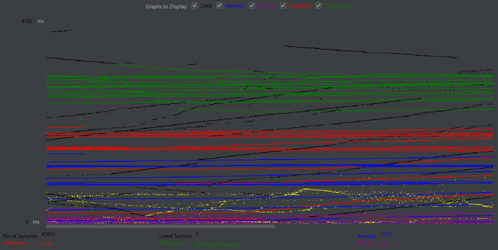
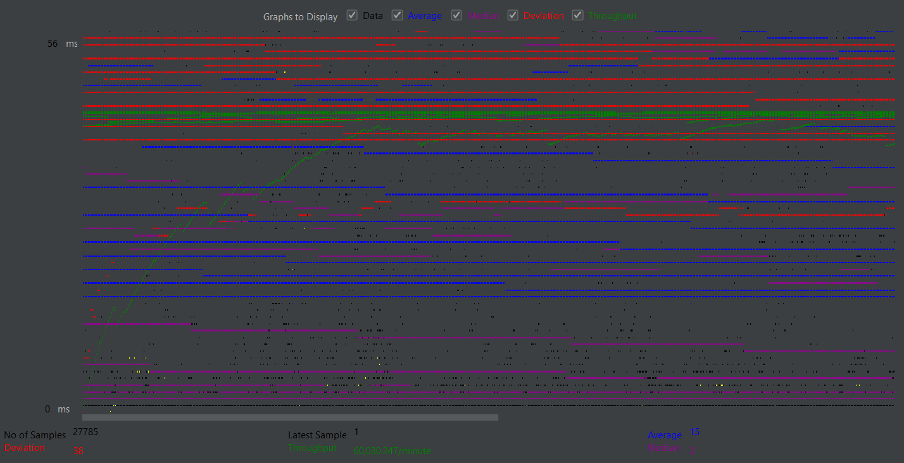

# Java Multithreaded Web Server

## 📖 Overview

A simple, high-performance HTTP web server built from scratch in Java. This project demonstrates how to handle concurrent client connections using a multithreaded architecture. It parses basic HTTP requests and serves static files from a local directory.

## ✨ Features

-   **Concurrent Request Handling**: Manages multiple clients at the same time.
-   **Lightweight**: Built using only core Java libraries.

## 📊 Performance Test Results: Single-Threaded vs. Multi-Threaded

The server's performance was benchmarked using **Apache JMeter** to show the advantages of a multi-threaded design compared to a single-threaded one under a heavy load.

### Single-Threaded Performance (Simulated)

A single-threaded server can only handle one request at a time. Under a heavy load, requests get queued, leading to high and inconsistent response times as the server struggles to keep up.

-   **Average Response:** 1672 ms
-   **Median Response:** 540 ms

### Multi-Threaded Performance

The multi-threaded architecture allows the server to handle thousands of concurrent connections with ease. Response times remain extremely low and stable, demonstrating superior performance and scalability.

-   **Average Response:** 15 ms
-   **Median Response:** 2 ms

